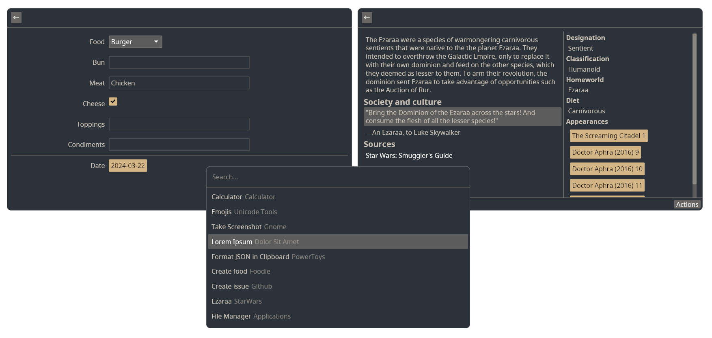

# Gauntlet

[](https://discord.gg/gFTqYUkBrW)


Web-first ~~cross-platform~~ (not yet) application launcher with React-based plugins.

> [!NOTE]
> Launcher is in active development, expect bugs, missing features, incomplete ux, etc.
>
> At the moment, it may not yet be ready for daily usage.
>
> There will probably be breaking changes which will be documented in [changelog](CHANGELOG.md).



## Features

- Plugin-first
    - Plugins are written in JavaScript
    - Plugins can have the following functionality
        - Create UI
        - One-shot commands
        - Dynamically provide list of one-shot commands
        - Render quick "inline" content directly under main search bar based in value in it
    - Currently, 3 bundled plugins are provided
        - Applications: provides list of applications
        - Calculator: shows result of mathematical operations directly under main search bar
        - Settings: open Gauntlet Settings from Gauntlet itself
    - Plugins are distributed as separate branch in git repository, meaning plugin distribution doesn't need any central
      server
    - Plugins are installed using Git Repository URL
- [React](https://github.com/facebook/react)-based UI for plugins
    - Implemented using custom React Reconciler
    - iced-rs is used for UI
- [Deno JavaScript Runtime](https://github.com/denoland/deno)
    - Deno allows us to sandbox JavaScript code for better security
    - Plugins are required to explicitly specify what permissions they need to work
    - NodeJS is still used to run tooling
- Client-Server architecture
    - All plugins run on server and render UI is rendered in separate client process
    - gRPC is used for inter-proces communication
- Designed with cross-platform in mind
    - Permissions
        - If plugin asked for access to filesystem, env variables, FFI or running commands, it is required to specify
          which operating systems it supports.
        - If plugin doesn't use filesystem, env variables, ffi or running commands and just uses network and/or UI, it
          is cross-platform
    - Shortcuts
        - Plugins are allowed to use only limited set of keys for shortcuts
        - Only upper and lower-case letters, symbols and numbers
        - Shortcut can have either `"main"` or `"alternative"` kind
            - `"main"` shortcut requires following modifiers
                - Windows and Linux: <kbd>CTRL</kbd>
                - macOS: <kbd>CMD</kbd>
            - `"alternative"` shortcut requires following modifiers
                - Windows and Linux: <kbd>ALT</kbd>
                - macOS: <kbd>OPT</kbd>
            - Whether <kbd>SHIFT</kbd> is also required depends on character specified for shortcut, e.g `$` will
              require <kbd>SHIFT</kbd> to be pressed, while `4` will not

##### OS Support

###### Implemented

-  Linux

###### Planned

-  Windows
-  macOS

##### UI

###### Implemented

- Detail
- Form
- Action Panel
- List
- Grid
- Separate settings window
- Stack-based Navigation
- Action Shortcuts

###### Planned

- Toast popups
- Keyboard only navigation in plugin-views
- Theming
- Themable icons
- Vim motions

##### APIs

###### Implemented

- Preferences
- Inline views under main search bar

###### Planned

- Clipboard
- Local Storage
- OAuth PKCE flow support

## Getting Started

### Create your own plugin

- Go to [plugin-template](https://github.com/project-gauntlet/plugin-template) and create your own GitHub repo from it.
- Run `npm run dev` to start dev server (requires running application server)
    - Dev server will automatically refresh the plugin on any file change
- Do the changes you need
    - You can configure plugin using [Plugin manifest](#plugin-manifest)
    - Documentation is, at the moment, basically non-existent but TypeScript declarations in `@project-gauntlet/api`
      and `@project-gauntlet/deno` should help
    - See Dev Plugin for examples 
- Push changes to GitHub
- Run `publish` GitHub Actions workflow to publish plugin to release branch
- Profit!

### Install plugin

Plugins are installed in Settings UI. Use Git repository name of the plugin to install it. 


### Install application

> [!NOTE]
> At the moment application is not published anywhere,
> so you have to download it from the [GitHub Releases](https://github.com/project-gauntlet/gauntlet/releases)

Be the first one to create a package. See [Application packaging for Linux](#application-packaging-for-Linux)

## Configuration

### Plugin manifest

```toml
[gauntlet]
name = 'Plugin Name'
description = """
Plugin description
""" # required

[[preferences]] # plugin preference
name = 'testBool'
type = 'enum' # available values: 'number', 'string,' 'bool', 'enum', 'list_of_strings', 'list_of_numbers', 'list_of_enums'
default = 'item' # type of default depends on type field. Currently, list types have no default
description = "Some preference description"
enum_values = [{ label = 'Item', value = 'item'}] # defines list of available enum values, required for types "enum" and "list_of_enums"

[[entrypoint]]
id = 'ui-view' # id for entrypoint
name = 'UI view' # name of entrypoint
path = 'src/ui-view.tsx' # path to file, default export is expected to be function React Function Component
type = 'view'
description = 'Some entrypoint description' # required

[[entrypoint.preferences]] # entrypoint preference
name = 'boolPreference'
type = 'bool'
default = true
description = "bool preference description"

[[entrypoint.actions]]
id = 'someAction' # id of action, needs to align with value in <Action> "id" property
description = "demo action description"
shortcut = { key = ':', kind = 'main'} # key string only accepts lower and upper-case letters, numbers and symbols. kind can be "main" or "alternative"

[[entrypoint]]
id = 'command-a' 
name = 'Command A'
path = 'src/command-a.ts' # path to file, the whole file is a js script
type = 'command'
description = 'Some entrypoint description' # required

[[entrypoint]]
id = 'command-generator'
name = 'Command generator'
path = 'src/command-generator.ts'
type = 'command-generator'
description = 'Some entrypoint description' # required

[[entrypoint]]
id = 'inline-view'
name = 'Inline view'
path = 'src/inline-view.tsx'
type = 'inline-view'
description = 'Some entrypoint description' # required

[permissions] # For allowed values see: https://docs.deno.com/runtime/manual/basics/permissions
environment = ["ENV_VAR_NAME"] # array of strings, if specified requires supported_system to be specified as well
high_resolution_time = false # boolean
network = ["github.com"] # array of strings
ffi = ["path/to/dynamic/lib"] # array of strings, if specified requires supported_system to be specified as well
fs_read_access = ["path/to/something"] # array of strings, if specified requires supported_system to be specified as well
fs_write_access = ["path/to/something"] # array of strings, if specified requires supported_system to be specified as well
run_subprocess = ["program"] # array of strings, if specified requires supported_system to be specified as well
system = ["apiName"] # array of strings, if specified requires supported_system to be specified as well

[[supported_system]]
os = 'linux' # currently only 'linux'

```

### Application config

Located at `$XDG_CONFIG_HOME/gauntlet/config.toml` for Linux. Not used at the moment.

## CLI

### Application

The Application has a simple command line interface

- `gauntlet server` - server part of launcher
- `gauntlet open` - opens application window, can be used instead of global shortcut
- `gauntlet management` - settings, plugin installation and removal, preferences, etc

### Dev Tools

[`@project-gauntlet/tools`](https://www.npmjs.com/package/@project-gauntlet/tools) contains separate CLI tool for plugin
development purposes. It has following commands:

- `gauntlet dev`
    - Starts development server which will automatically refreshed plugin on any file change.
- `gauntlet build`
    - Builds plugin
- `gauntlet publish`
    - Publishes plugin to separate git branch. Includes `build`
    - `publish` assumes some things about git repository, so it is recommended to publish plugin from GitHub Actions
      workflow

[Plugin template](https://github.com/project-gauntlet/plugin-template) has nice `npm run` wrappers for them.

## Architecture

The Application consists of three parts: server, frontend and settings.
Server is an application that exposes gRPC server.
All plugins run on server.
Each plugin in its own sandboxed Deno Worker.
In plugin manifest it is possible to configure permissions which will allow plugin to have access to filesystem,
network, environment variables, ffi or subprocess execution.
Server saves plugins and state of plugins into SQLite database.

Frontend is GUI application that uses [iced-rs](https://github.com/iced-rs/iced) as a GUI framework.
It is also exposes gRPC server that is used by server to render views

Plugins can create UI using [React](https://github.com/facebook/react).
Server implements custom React Reconciler (similar to React Native)
and renders to frontend running as a separate process.
Server listens on signals from frontend, so when user opens view defined by plugin, frontend sends an open-view signal.
Server then receives the signal, runs React render and React Reconciler
makes requests to the frontend containing information what actually should be rendered.
When a user interacts with the UI by clicking button or entering text into form,
frontend sends signals to server to see whether any re-renders are needed.

Settings is also a GUI application that communicates with server via gRPC using a simple request-response approach.


Plugins (or rather its compiled state) are distributed via Git repository in `release` branch (similar to GitHub Pages).
Which means there is no one central place for plugin distribution.
And to install plugin all you need is Git repository url.

Application defines set of React components to use for plugins.
Creating and validating components involves some boilerplate.
Component model was created for help manage is.
It is essentially a json file which defines what components exist, what properties and event handler they have.
This file is then used
to generate TypeScript typings for `@project-gauntlet/api` and Rust validation code for server and frontend.

## Application packaging for Linux

This section contains a list of things
that could be useful fir someone who wants to package application for Linux distribution.
If something is missing, please [create an issue](https://github.com/project-gauntlet/gauntlet/issues).

Gauntlet executable consists of three applications:

- `$ path/to/gauntlet/executable server`
    - Needs to be started when user logs in
- `$ path/to/gauntlet/executable open`
    - Expected to be run on demand using some global shortcut
- `$ path/to/gauntlet/executable management`
    - Started on demand from the list of available applications (will vary depending on desktop environment or window
      manager chosen) or from Gauntlet itself

Settings applications expect Server to always be running.
Recommended way of ensuring that is running Server as SystemD service.

###### Directories used

- data dir - `$XDG_DATA_HOME/gauntlet` or `$HOME/.local/share/gauntlet`
    - contains application state `data.db`
- cache dir - `$XDG_CACHE_HOME/gauntlet` or `$HOME/.cache/gauntlet`
    - contains icon cache
- config dir - `$XDG_CONFIG_HOME/gauntlet` or `$HOME/.config/gauntlet`
    - contains application config `config.toml`
    - application will never do changes to config file
- `.desktop` file at locations defined by [Desktop Entry Specification](https://specifications.freedesktop.org/desktop-entry-spec/desktop-entry-spec-latest.html)

Application and Dev Tools use temporary directories:

- Rust: [tempfile crate](https://crates.io/crates/tempfile)
- JS: [NodeJS mkdtemp](https://nodejs.org/api/fs.html#fspromisesmkdtempprefix-options)

Client and Setting applications have GUI and therefore use all the usual graphics-related stuff from X11.
Wayland is not supported at the moment.

## Building Gauntlet
You will need:
- NodeJS v18
- Rust
- Protobuf Compiler

To build dev run:
```bash
npm install
npm run build
cd ./dev_plugin
npm run build
cd ..
cargo build
```
In dev (without "release" feature) application will use only directories inside project directory to store state or cache.
Additionally, for easier development frontend will not be automatically executed and need to be started manually with GAUNTLET_INTERNAL_FRONTEND environment variable set to any value.

To build release run:
```bash
npm install
npm run build
cargo build --release --features release
```
But the new version release needs to be done via GitHub Actions

## Versioning

### Application

Application uses simple incremental integers starting from `1`.
It doesn't follow the SemVer versioning.
Given application's reliance on plugins, once it is stable,
introducing breaking changes will be done carefully (if at all) and will be given a reasonable grace period to migrate.
SemVer is about a hard cutoff between major versions with breaking changes, which doesn't fit this kind of application.
Before application is declared stable, breaking changes could be done without a grace period.

### Tools

[`@project-gauntlet/tools`](https://www.npmjs.com/package/@project-gauntlet/tools) uses SemVer.

### Plugins

Plugins only have the latest published "version". 
