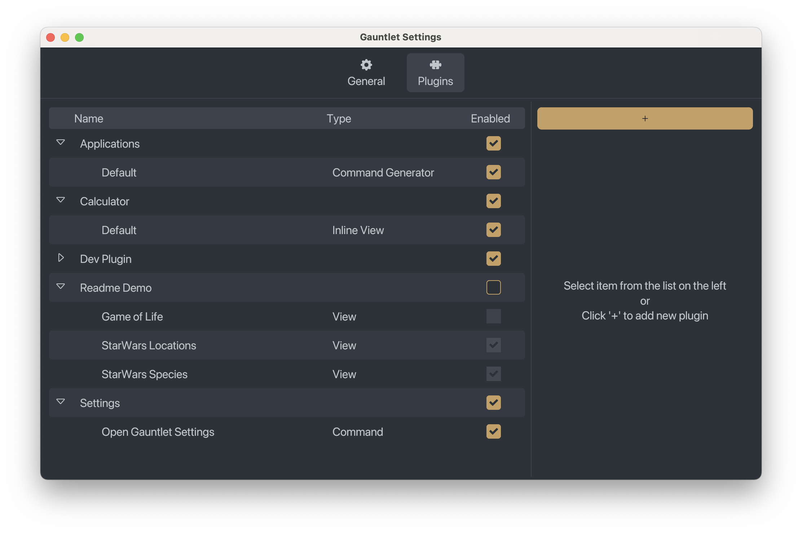
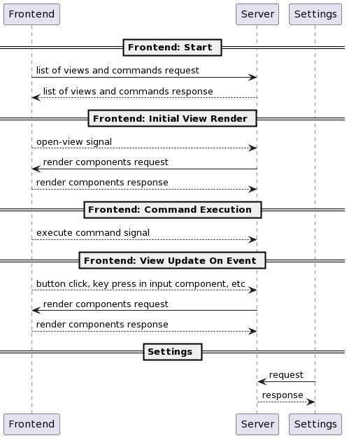
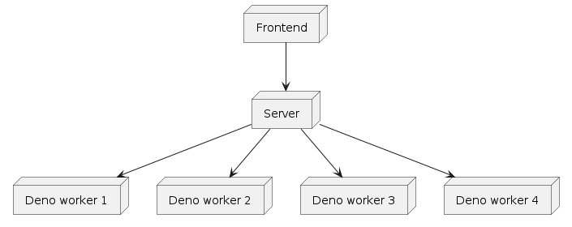

# Gauntlet

[](https://discord.gg/gFTqYUkBrW)


Web-first cross-platform application launcher with React-based plugins.

> [!NOTE]
> Launcher is in active development, expect bugs, missing features, incomplete ux, etc.
>
> There will probably be breaking changes which will be documented in [changelog](CHANGELOG.md).

https://github.com/user-attachments/assets/19964ed6-9cd9-48d4-9835-6be04de14b66

## Features

- Plugin-first
    - Plugins are written in TypeScript
    - Plugins can have the following functionality
        - Create UI
        - One-shot commands
        - Dynamically provide list of one-shot commands
        - Render quick "inline" content directly under main search bar based on value in it
        - Get content from and add to Clipboard
    - Currently, 3 bundled plugins are provided
        - Applications: provides list of applications
        - Calculator: shows result of mathematical operations directly under main search bar
          - Powered by [Numbat](https://github.com/sharkdp/numbat)
        - Settings: open Gauntlet Settings from Gauntlet itself
    - Plugins are distributed as separate branch in Git repository, meaning plugin distribution doesn't need any central
      server
    - Plugins IDs are just Git Repository URLs
- [React](https://github.com/facebook/react)-based UI for plugins
    - Implemented using custom React Reconciler (no Electron)
    - [iced-rs](https://github.com/iced-rs/iced) is used for UI
- [Deno JavaScript Runtime](https://github.com/denoland/deno)
    - Deno allows us to sandbox JavaScript code for better security
    - Plugins are required to explicitly specify what permissions they need to work
    - NodeJS is used to run plugin tooling, but as a plugin developer you will always write code that runs on Deno
- Frecency-based search result ordering
   - Frecency is a combination of frequency and recency
   - More often the item is used the higher in the result list it will be, but items used a lot in the past will be ranked lower than items used the same amount of times recently
- Designed with cross-platform in mind
    - Permissions
        - By default, plugins do not have access to host system
        - If plugin asked for access to filesystem, env variables, FFI or running commands, it is required to specify
          which operating systems it supports.
        - If plugin doesn't use filesystem, env variables, ffi or running commands and just uses network and/or UI, it
          is cross-platform
    - Shortcuts
        - Plugins are allowed to use only limited set of keys for shortcuts to support widest possible range of keyboards 
            - Only upper and lower-case letters, symbols and numbers
        - Shortcut can have either `"main"` or `"alternative"` kind so plugins do not need to specify shortcut separately for each OS
            - `"main"` shortcut requires following modifiers
                - Windows and Linux: <kbd>CTRL</kbd>
                - macOS: <kbd>CMD</kbd>
            - `"alternative"` shortcut requires following modifiers
                - Windows and Linux: <kbd>ALT</kbd>
                - macOS: <kbd>OPT</kbd>
            - Whether <kbd>SHIFT</kbd> is also required depends on character specified for shortcut, e.g `$` will
              require <kbd>SHIFT</kbd> to be pressed, while `4` will not

##### OS Support

-  Linux
   - Both X11 and Wayland (via LayerShell protocol) are supported
-  macOS
-  Windows
    - built-in "Applications" plugin is not yet implemented. See [#9](https://github.com/project-gauntlet/gauntlet/issues/9)

##### UI

###### Implemented

- Detail
- Form
- Action Panel
- List
- Grid
- Inline
  - View directly under main search bar
  - Requires separate permission to be explicitly specified in manifest because it reads everything user enters in main search bar
- Settings window
- Action Shortcuts
- Theming

###### Planned

See [#13](https://github.com/project-gauntlet/gauntlet/issues/13)

##### APIs

- Stack-based Navigation
- Assets
  - Files placed into `assets` directory in root of plugin repository are accessible at plugin runtime using `assetData` function 
- Preferences
  - Preferences defined in plugin manifest can be set by user and are accessible at plugin runtime using `pluginPreferences` and `entrypointPreferences` functions
- Clipboard
  - Accessible via `Clipboard` api
  - Requires separate permission to be explicitly specified in manifest
- React Helper Hooks
    - `usePromise`
        - Helper to run promises in a context of React view
        - Returns `AsyncState` object which contains `isLoading`, `error` and `data` properties
    - `useStorage`
        - Helper to store data between entrypoint, plugin and application runs
        - Follows API similar to `useState` built-in React Hook
        - Uses `localStorage` internally
    - `useCache`
        - Helper to store data between entrypoint runs but will be reset when plugin or application is restarted
        - Follows API similar to `useState` built-in React Hook
        - Uses `sessionStorage` internally
    - `useCachedPromise`
        - Helper to run promises with caching done automatically
        - Follows `stale-while-revalidate` caching strategy
        - Uses `usePromise` and `useCache` Hooks internally
    - `useFetch`
        - Helper to run `fetch()` with caching done automatically
        - Follows `stale-while-revalidate` caching strategy
        - Uses `useCachedPromise` Hook internally

###### Planned

See [#13](https://github.com/project-gauntlet/gauntlet/issues/13)

## Getting Started

### Create your own plugin

- Go to [plugin-template](https://github.com/project-gauntlet/plugin-template) and create your own GitHub repo from it.
- Run `npm run dev` to start dev server (requires running application server)
    - Dev server will automatically refresh the plugin on any file change
- Do the changes you need
    - You can configure plugin using [Plugin manifest](#plugin-manifest)
    - Documentation is, at the moment, basically non-existent but TypeScript declarations in `@project-gauntlet/api`
      and `@project-gauntlet/deno` should help
    - For examples see [Dev Plugin](dev_plugin). It is very busy because it is used for Gauntlet development, but it has examples of pretty much every available API 
- Push changes to GitHub
- Run `publish` GitHub Actions workflow to publish plugin to `gauntlet/release` branch
- Profit!

### Install plugin

Plugins are installed in Settings UI. Use Git repository url of the plugin to install it. 



### Install application

#### macOS

Although it is possible to install Gauntlet by using `.dmg` directly, application doesn't have auto-update functionality so it is recommended to install using `brew` package manager.

Brew package: [link](https://formulae.brew.sh/cask/gauntlet)

To install run:
```
brew install --cask gauntlet
```

To start, manually open application.

#### Windows

Although it is possible to install Gauntlet by using `.msi` directly, application doesn't have auto-update functionality so it is recommended to install using `chocolatey` package manager.

Chocolatey package: [link](https://community.chocolatey.org/packages/gauntlet)

To install run:
```
choco install gauntlet
```

To start, manually open application.

#### Arch Linux

AUR package: [link](https://aur.archlinux.org/packages/gauntlet-bin)

To install run:
```
yay -S gauntlet-bin
```

To start `systemd` service run: 
```
systemctl --user enable --now gauntlet.service
```

#### Other Linux Distributions

At the moment application is only available for Arch Linux. If you want to create a package for other distributions see [Application packaging for Linux](#application-packaging-for-Linux)

### Global Shortcut
Main window can be opened using global shortcut or CLI command:
- Shortcut:
    - Windows: <kbd>ALT</kbd> + <kbd>Space</kbd>
    - Linux X11: <kbd>Super</kbd> + <kbd>Space</kbd>
    - Linux Wayland: No global shortcut. Please use CLI command
    - macOS: <kbd>CMD</kbd> + <kbd>Space</kbd>
    - Can be changed in Settings
- CLI command:
    - `gauntlet open`

## Configuration

### Plugin manifest

```toml
[gauntlet]
name = 'Plugin Name'
description = """
Plugin description
""" # required

[[preferences]] # plugin preference
name = 'testBool'
type = 'enum' # available values: 'number', 'string,' 'bool', 'enum', 'list_of_strings', 'list_of_numbers', 'list_of_enums'
default = 'item' # type of default depends on type field. Currently, list types have no default
description = "Some preference description"
enum_values = [{ label = 'Item', value = 'item'}] # defines list of available enum values, required for types "enum" and "list_of_enums"

[[entrypoint]]
id = 'ui-view' # id for entrypoint
name = 'UI view' # name of entrypoint
path = 'src/ui-view.tsx' # path to file, default export is expected to be function React Function Component
type = 'view'
description = 'Some entrypoint description' # required

[[entrypoint.preferences]] # entrypoint preference
name = 'boolPreference'
type = 'bool'
default = true
description = "bool preference description"

[[entrypoint.actions]]
id = 'someAction' # id of action, needs to align with value in <Action> "id" property
description = "demo action description"
shortcut = { key = ':', kind = 'main'} # key string only accepts lower and upper-case letters, numbers and symbols. kind can be "main" or "alternative"

[[entrypoint]]
id = 'command-a' 
name = 'Command A'
path = 'src/command-a.ts' # path to file, the whole file is a js script
type = 'command'
description = 'Some entrypoint description' # required

[[entrypoint]]
id = 'command-generator'
name = 'Command generator'
path = 'src/command-generator.ts'
type = 'command-generator'
description = 'Some entrypoint description' # required

[[entrypoint]]
id = 'inline-view'
name = 'Inline view'
path = 'src/inline-view.tsx'
type = 'inline-view'
description = 'Some entrypoint description' # required

[permissions] # For allowed values see: https://docs.deno.com/runtime/manual/basics/permissions
environment = ["ENV_VAR_NAME"] # array of strings, if specified requires supported_system to be specified as well
high_resolution_time = false # boolean
network = ["github.com"] # array of strings
ffi = ["path/to/dynamic/lib"] # array of strings, if specified requires supported_system to be specified as well
fs_read_access = ["path/to/something"] # array of strings, if specified requires supported_system to be specified as well
fs_write_access = ["path/to/something"] # array of strings, if specified requires supported_system to be specified as well
run_subprocess = ["program"] # array of strings, if specified requires supported_system to be specified as well
system = ["apiName"] # array of strings, if specified requires supported_system to be specified as well

[[supported_system]]
os = 'linux' # 'linux', 'windows' or 'macos'

```

### Application config

Located at `$XDG_CONFIG_HOME/gauntlet/config.toml` for Linux. Not used at the moment.

## CLI

### Application

The Application has a simple command line interface

- `gauntlet` - starts server
  - `gauntlet --minimized` - starts server without opening main window 
- `gauntlet open` - opens application window, can be used instead of global shortcut
- `gauntlet settings` - settings, plugin installation and removal, preferences, etc
- `gauntlet generate-sample-color-theme` - generate sample color theme. See: [THEME.md](./docs/THEME.md)
- `gauntlet generate-sample-theme` - generate sample theme. See: [THEME.md](./docs/THEME.md)

### Dev Tools

[`@project-gauntlet/tools`](https://www.npmjs.com/package/@project-gauntlet/tools) contains separate CLI tool for plugin
development purposes. It has following commands:

- `gauntlet dev`
    - Starts development server which will automatically refreshed plugin on any file change.
- `gauntlet build`
    - Builds plugin
- `gauntlet publish`
    - Publishes plugin to separate git branch. Includes `build`
    - `publish` assumes some things about git repository, so it is recommended to publish plugin from GitHub Actions
      workflow

[Plugin template](https://github.com/project-gauntlet/plugin-template) has nice `npm run` wrappers for them.

## Theming

See [THEME.md](./docs/THEME.md)

## Architecture

The Application consists of three parts: server, frontend and settings.
Server is an application that exposes gRPC server.
All plugins run on server.
Each plugin in its own sandboxed Deno Worker.
In plugin manifest it is possible to configure permissions which will allow plugin to have access to filesystem,
network, environment variables, ffi or subprocess execution.
Server saves plugins themselves and state of plugins into SQLite database.

Frontend is GUI module that uses [iced-rs](https://github.com/iced-rs/iced) as a GUI framework. It is run in the same process as a server.

Plugins can create UI using [React](https://github.com/facebook/react).
Server implements custom React Reconciler (similar to React Native) which renders GUI components to frontend.
Server listens on signals from frontend, so when user opens view defined by plugin, frontend sends an open-view request.
Server then receives it, runs React render and React Reconciler
makes requests to the frontend containing information what actually should be rendered.
When a user interacts with the UI by clicking button or entering text into form,
frontend sends events to server to see whether any re-renders are needed.

Settings is a GUI application runs in separate process that communicates with server via gRPC using a simple request-response approach.

Simplified gRPC communication:


Components:


Each component runs in a separate thread. Main thread is the thread that renders GUI. Each component has its own tokio runtime instance. 

Plugins (or rather its compiled state: manifest, js code and assets) are distributed via Git repository in `gauntlet/release` branch (similar to GitHub Pages).
Which means there is no one central place required for plugin distribution.
And to install plugin all you need is Git repository url.

Application defines set of React components to use for plugins.
Creating and validating components involves some boilerplate.
Component model was created for help manage is.
It is essentially a json file which defines what components exist, what properties and event handler they have.
This file is then used
to generate TypeScript typings for `@project-gauntlet/api` and Rust validation code for server and frontend.

## Application packaging for Linux

This section contains a list of things
that could be useful for someone who wants to package application for Linux distribution.
If something is missing, please [create an issue](https://github.com/project-gauntlet/gauntlet/issues).

Application is already packaged for Arch Linux so you can use it as example, see [Arch Linux](#arch-linux)

Relevant CLI commands:

- `$ gauntlet --minimized`
    - Server needs to be started when user logs in, e.g. using `systemd` service
- `$ gauntlet open`
    - Main windows is usually opened using [global shortcut](#global-shortcut), this CLI command can be used in cases where global shortcut functionality is not available 
- `$ gauntlet settings`
    - Settings are usually started on demand from Gauntlet itself

`.desktop` sample file can be found [here](assets/linux/gauntlet.desktop)

`systemd` service sample file can be found [here](assets/linux/gauntlet.service)

###### Directories used

- data dir - `$XDG_DATA_HOME/gauntlet` or `$HOME/.local/share/gauntlet`
    - contains application state `data.db`
- cache dir - `$XDG_CACHE_HOME/gauntlet` or `$HOME/.cache/gauntlet`
    - contains icon cache
- config dir - `$XDG_CONFIG_HOME/gauntlet` or `$HOME/.config/gauntlet`
    - contains application config `config.toml`
    - application will never do changes to config file
- state dir - `$XDG_STATE_HOME/gauntlet` or `$HOME/.local/state/gauntlet`
    - contains log files created by plugin development 
- `.desktop` files at locations defined by [Desktop Entry Specification](https://specifications.freedesktop.org/desktop-entry-spec/desktop-entry-spec-latest.html)

Application and Dev Tools use temporary directories:

- Rust: [tempfile crate](https://crates.io/crates/tempfile)
- JS: [NodeJS mkdtemp](https://nodejs.org/api/fs.html#fspromisesmkdtempprefix-options)

X11 API is used to add global shortcut

Client and Setting applications have GUI and therefore use all the usual graphics-related stuff from X11.
Wayland support requires LayerShell protocol `zwlr_layer_shell_v1`.

## Building Gauntlet
You will need:
- NodeJS
- Rust
- Protobuf Compiler
- CMake (not used by the project itself, but is required by a dependency)
- On Linux: `libxkbcommon-dev` (note: name may differ depending on used distribution)

To build dev run:
```bash
git submodule update --init
npm ci
npm run build
npm run build-dev-plugin
cargo build
```
In dev (without "release" feature) application will use only directories inside project directory to store state or cache.

To build release run:
```bash
git submodule update --init
npm ci
npm run build
cargo build --release --features release
```
But the new version release needs to be done via GitHub Actions

## Contributing

If you'd like to help build Gauntlet you can do it in more ways than just contributing code:
- Reporting a bug or UI/UX problem
- Creating a plugin
- Creating and contributing a theme - see [#16](https://github.com/project-gauntlet/gauntlet/issues/16)

If you are looking for things to do see pinned [issues](https://github.com/project-gauntlet/gauntlet/issues).

For simple problems feel free to open an issue or PR and tackle it yourself!

For more significant changes please contact creators on Discord (invite link on top of README) and discuss first.

All and any contributions are welcome.

## Versioning

### Application

Application uses simple incremental integers starting from `1`.
It doesn't follow the SemVer versioning.
Given application's reliance on plugins, once it is stable,
introducing breaking changes will be done carefully (if at all) and will be given a reasonable grace period to migrate.
SemVer is about a hard cutoff between major versions with breaking changes, which doesn't fit this kind of application.
Before application is declared stable, breaking changes could be done without a grace period.

### Tools

[`@project-gauntlet/tools`](https://www.npmjs.com/package/@project-gauntlet/tools) uses SemVer.

### Plugins

Plugins only have the latest published "version". 
